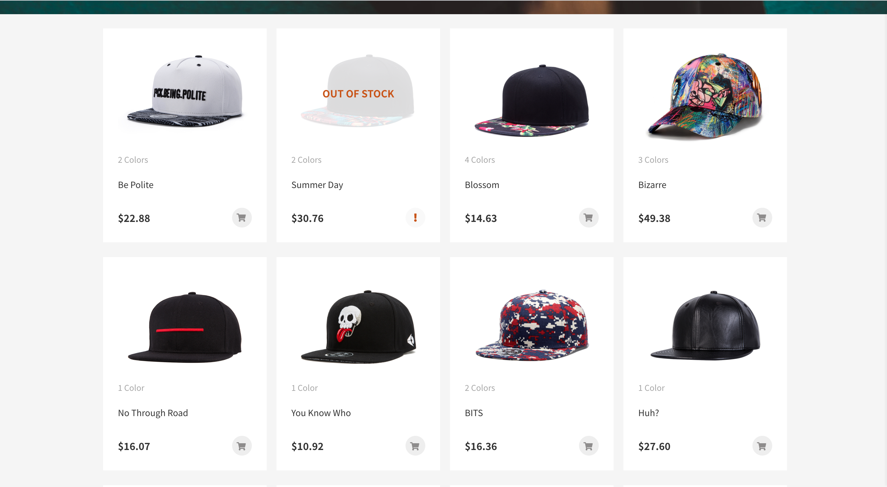
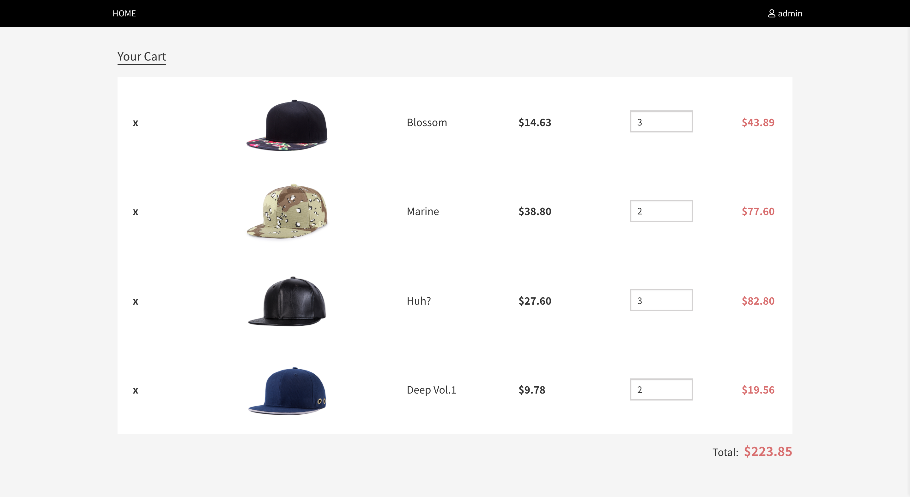

# React Caps

**Carousel**

**ProductsScreen**

**Shoppint Cart**

## Tech Stack

>  More information in `package.json`

 - React @17.0.1
 - React Router @5.2.0
 - react-transition-group
 - JSON Server
 - Axios
 - pubsub-js
 - node-sass 

## Quick Guide

### Installation

(NodeJS runtime is required)

In terminal, cd into the root directory and type in `yarn install` to install all dependencies.

### Running

With dependencies installed，in terminal type in `yarn start`.

After server start, the opening of browser will be enbaled automatically with content displayed at `localhost:3000` by default. 

If this is disabled, please visit the URL manually.

## Application Architecture
    .
    ├─ public/ 
    │   ├─ images/	               
    │   ├─ index.html              
    ├─ src/                        
    │   ├─ components/             
    │   │   ├─ AddInventory.jsx       
    │   │   ├─ Arrows.jsx             
    │   │   ├─ Carousel.jsx          
    │   │   ├─ CarouselContent.jsx   
    │   │   ├─ CartItem.jsx           
    │   │   ├─ Dots.jsx               
    │   │   ├─ EditInventory.jsx               
    │   │   ├─ Header.jsx                
    │   │   ├─ Panel.jsx              
    │   │   ├─ Product.jsx           
    │   │   ├─ ProductsScreen.jsx             
    │   │   ├─ Profile.jsx     
    │   │   ├─ ToolBox.jsx 
    │   ├─ config/ 
    │   │   ├─ axios.js 
    │   ├─ pages/
    │   │   ├─ App.js 
    │   │   ├─ Cart.jsx 
    │   │   ├─ Login.jsx 
    │   │   ├─ NotFound.jsx
    │   │   ├─ Regisger.jsx 
    │   ├─ services/ 
    │   │   ├─ auth.js 
    │   ├─ utils/
    │   │   ├─ formatPrice.js 
    │   │   ├─ sliderImages.js 
    ├── index.js
    ├── index.scss
    ├── Layout.js 
    ├── Router.js                 

### Description

 - Sass precompiler for application layout
 - React-Route for frontend routing
 - JSON server as backend for mock data
 - Axios for HTTP requests
 - Native DOM manipulation for a popup panel